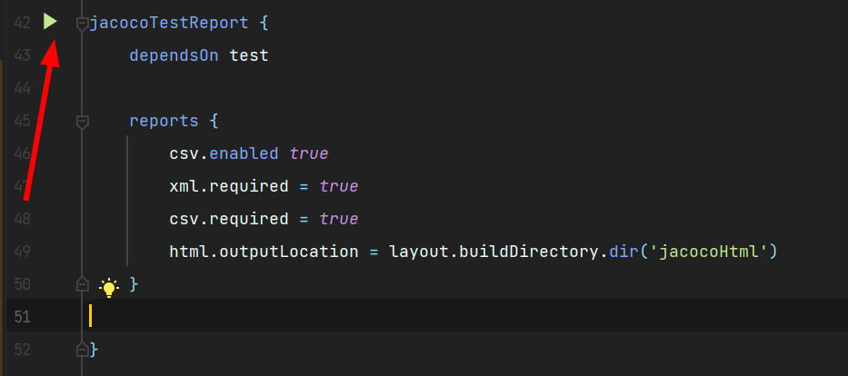

# Что нужно делать

В рамках данной лабораторной работы нужно написать тесты для кода
предыдущих лабораторных. Также необходимо оценить процент покрытия кода тестами с помощью jacoco.
Лабораторная считается выполненной при достижении 60% покрытия строк кода (instructions) 
и 60% покрытия условий ветвления (branches).

Шаги выполнения: 
1) Обновить ваш проект с предыдущих лабораторных в соответствии с файлами из данного репозитория
   * заменить вашу конфигурацию gradle на ту, что лежит в файле [build.gradle](application/build.gradle) проекта 
   * поместить [файл](application/src/main/resources/lombok.config) в соответствующую папку вашего проекта
2) Создать классы и методы для написания тестов.
3) Написать код тестов придерживаясь стиля GWT. Примеры можно найти в данном репозитории по пути application/src/test/java
4) Запустить проверку покрытия jacoco с помощью команды в консоли:
```bash
gradlew jacocoTestReport
```
Либо открыть build.gradle и нажать на кнопку запуска 


Рассчитанные метрики можно посмотреть открыв файл application/build/jacocoHtml/index.html
в браузере. Данный файл создаётся только после запуска проверки покрытия jacoco.


# Полезные ссылки
* Что так покрытие кода (Ru): https://habr.com/ru/post/345774/
* Что такое GWT (En): https://proandroiddev.com/given-when-then-our-testing-approach-c9087b291c36